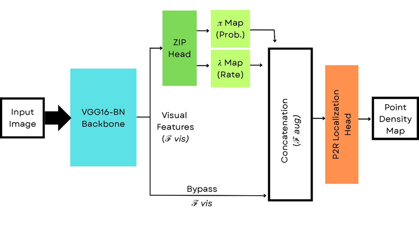

# P2R-ZIP: Point-to-Region Counting with Zero-Inflatable Poisson Modeling

Questa repository contiene l'implementazione del modello **P2R-ZIP**, un'evoluzione dell'architettura *Point-to-Region* (P2R) progettata per il crowd counting in scenari complessi. Il progetto introduce una testa di classificazione statistica basata sulla distribuzione di **Poisson gonfiata a zero (ZIP)** per migliorare la distinzione semantica tra aree di folla e background.

## Architettura del Modello

Il modello integra due stadi principali per un'analisi congiunta della scena:

1.  **ZIP Head (Semantic Reasoning):** Un modulo statistico che analizza le feature estratte dal backbone (VGG16) per modellare la distribuzione dei pixel. Produce due mappe fondamentali:
    * **$\pi$-map:** Rappresenta la probabilità di occupazione (presenza di folla) per ogni regione.
    * **$\lambda$-map:** Stima l'intensità locale della folla basata su una regressione a bin.
2.  **P2R Head (Localization):** Il modulo di regressione finale che riceve le feature del backbone aumentate con le informazioni semantiche provenienti dallo ZIP Head (canali $\pi$ e $\lambda$ concatenati).




### Strategie di Fusione
Il progetto supporta diverse modalità di integrazione semantica per guidare la regressione della densità:
* **Soft Fusion (Bypass Gating):** Le mappe $\pi$ e $\lambda$ vengono utilizzate come feature aggiuntive, permettendo al modello di mantenere tutta l'informazione del backbone guidandola con "hint" statistici.
* **Hard Gating:** La $\pi$-map agisce come una maschera binaria per sopprimere attivamente il rumore nelle regioni identificate come background.

## Protocollo di Addestramento (Curriculum Learning)

L'addestramento segue una strategia multi-stadio per garantire la stabilità della convergenza e l'apprendimento progressivo delle caratteristiche:

* **Stage 1 (ZIP Training):** Training isolato dello **ZIP Head** utilizzando la Zero-Inflatable Poisson NLL Loss per modellare la sparsity della scena.
* **Stage 2 (P2R Training):** Addestramento del modulo **P2R** standalone per consolidare le capacità di regressione della densità.
* **Stage 3 (Joint Fine-Tuning):** Addestramento congiunto dell'intera architettura utilizzando una **Composite Loss** che bilancia l'accuratezza del conteggio e la corretta classificazione semantica.

## Requisiti e Installazione

Il codice richiede un ambiente Python 3.8+ con le seguenti librerie principali:
* PyTorch
* Seaborn / Matplotlib (per la visualizzazione della Confusion Matrix e delle mappe)
* Scikit-learn

```bash
git clone [https://github.com/Christian1301/p2r.git](https://github.com/Christian1301/p2r.git)
cd p2r
pip install -r requirements.txt