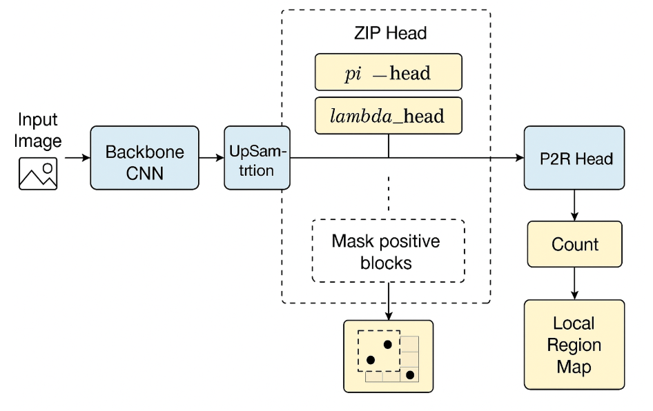

# P2R-ZIP: Crowd Counting with Zero-Inflated Poisson + Point-to-Region Refinement

---

### 📘 Descrizione del progetto

**P2R-ZIP** è un framework di *crowd counting* che unisce due approcci complementari:

1. **ZIP (Zero-Inflated Poisson)** — Modello statistico per stimare la presenza e l’intensità di persone a livello di blocchi.  
2. **P2R (Point-to-Region)** — Rete di raffinamento che genera una mappa di densità precisa a livello pixel.

L’obiettivo è creare un’architettura che prima individua le regioni dove ci sono persone (*coarse estimation*), e poi le raffina in modo dettagliato (*fine estimation*).  
Questo è ottenuto tramite un flusso sequenziale:
Input → Backbone CNN → ZIP Head → Mask π → P2R Head → Density Map

---

## 🧩 Architettura

- **Backbone condiviso:** es. VGG16-BN o ResNet50 pre-addestrato su ImageNet.
- **ZIP Head:** calcola per ogni blocco:
  - pi: probabilità che il blocco contenga persone,
  - lambda: valore atteso di conteggio (Poisson rate).
- **P2R Head:** prende le feature mascherate dalla ZIP Head e produce una mappa di densità raffinata.

<p align="center">
  
  <br>
  <em>Figura 1 — Flusso sequenziale ZIP → P2R (Zero-Inflated Poisson + Point-to-Region Refinement).</em>
</p>

---

## ⚙️ Struttura del repository

```text
P2R_ZIP/
├─ models/
│  ├─ backbone.py          # Backbone CNN
│  ├─ zip_head.py          # Testa ZIP (π, λ)
│  ├─ p2r_head.py          # Testa P2R
│  └─ p2r_zip_model.py     # Architettura combinata ZIP→P2R
│
├─ datasets/
│  ├─ base_dataset.py      # Classe base per caricamento immagini e punti
│  ├─ jhu.py, shha.py, ucf_qnrf.py, nwpu.py   # Dataset supportati
│
├─ losses/
│  ├─ zip_nll.py           # Loss Zero-Inflated Poisson NLL
│  └─ p2r_losses.py        # Loss MSE + opzionale L1 sul conteggio
│
├─ train_utils.py          # Resume, checkpoint, TensorBoard writer
│
├─ train_stage1_zip.py     # Fase 1: pre-training ZIP
├─ train_stage2_p2r.py     # Fase 2: training P2R con ZIP congelato
├─ train_stage3_joint.py   # Fase 3: fine-tuning congiunto
│
├─ infer.py                # Inferenza end-to-end ZIP→P2R
├─ config.yaml             # Configurazione completa esperimento
└─ README.md
```


## 🧠 Perché ci sono **tre file di training**

L’addestramento del modello **P2R-ZIP** è suddiviso in **tre stadi progressivi**, progettati per garantire stabilità numerica, separazione dei compiti e una convergenza più robusta.  
Ogni fase affronta un sotto-problema specifico del crowd counting e contribuisce in modo complementare al risultato finale.

---

### 🩵 1️⃣ Stage 1 — Pre-training ZIP (Zero-Inflated Poisson)
**Obiettivo:**  
Addestrare la testa ZIP e il backbone a stimare correttamente la *distribuzione dei conteggi* nei blocchi dell’immagine.

**Motivazione:**  
Le immagini di crowd counting contengono moltissime regioni vuote.  
Un modello non supervisionato su queste aree rischierebbe di imparare rumore.  
La ZIP Loss consente di modellare in modo statistico sia:
- la probabilità che un blocco contenga zero persone (pi),
- l’intensità media dei conteggi (lambda) nei blocchi non vuoti.

**Cosa impara:**  
- Il backbone estrattore di feature visive.  
- La ZIP Head, che distingue tra regioni *vuote* e *popolate*.  

**Output:**  
Un modello che sa *“dove guardare”* — individua con buona precisione le zone dove è probabile che ci sia crowd.

---

### 💙 2️⃣ Stage 2 — Training P2R (Point-to-Region)
**Obiettivo:**  
Raffinare la mappa di densità a livello di pixel, partendo dalle aree identificate dal modulo ZIP.

**Motivazione:**  
La stima ZIP è a grana grossa (per blocchi 16×16 o 32×32 pixel).  
Per ottenere conteggi precisi servono mappe *dense e continue* che riflettano le annotazioni puntuali.  

Durante questo stage:
- Il **backbone e la ZIP Head vengono congelati** (non aggiornati).  
- Si addestra **solo la P2R Head**, che apprende a proiettare le feature filtrate dalla maschera ZIP in una mappa di densità continua.  

**Loss utilizzata:**  
L_{P2R} = L_{MSE} + \beta L_{count}

dove il termine L1 opzionale garantisce coerenza nel conteggio totale.

**Cosa impara:**  
- La P2R Head apprende a stimare “quanto e dove” ci sono persone all’interno delle regioni attive previste da ZIP.  

**Output:**  
Un modello che sa *“quanto e dove esattamente”*, ma sempre vincolato dalle regioni ZIP.

---

### 💜 3️⃣ Stage 3 — Joint Fine-tuning (Ottimizzazione congiunta)
**Obiettivo:**  
Integrare le due componenti (ZIP + P2R) in un addestramento unico, bilanciando le loro loss per ottenere una predizione coerente tra scala globale e scala locale.

**Motivazione:**  
Dopo le due fasi precedenti, ZIP e P2R lavorano bene separatamente ma non necessariamente in sinergia.  
Il fine-tuning congiunto consente di:
- adattare le feature condivise del backbone,
- migliorare la coerenza tra la probabilità di crowd (ZIP) e la densità generata (P2R),
- ottimizzare insieme la precisione e la consistenza globale.

**Loss combinata:**  
L_{total} = L_{ZIP} + \alpha L_{P2R}
dove:
- L_{ZIP} regola la stima dei blocchi e la struttura globale,  
- L_{P2R} regola la precisione locale pixel-wise,  
- \alpha  controlla il peso relativo dei due obiettivi.

**Interpretazione:**  
ZIP guida P2R fornendo un contesto spaziale affidabile;  
P2R affina la stima dentro le regioni attive di ZIP, migliorando la precisione del conteggio.

**Output:**  
Un modello end-to-end stabile, capace di combinare accuratezza locale e robustezza globale.

---

### 🧩 Riassunto visivo

| Stage | Moduli addestrati | Obiettivo | Output |
|-------|--------------------|------------|---------|
| **1️⃣ ZIP Pre-training** | Backbone + ZIP Head | Imparare dove c’è crowd (regioni attive) | Maschera π e λ per blocchi |
| **2️⃣ P2R Training** | P2R Head | Raffinare la densità pixel-wise | Mappa densità coerente con i punti |
| **3️⃣ Joint Fine-tuning** | Tutto il modello | Integrare ZIP e P2R per coerenza globale | Predizione end-to-end stabile |

---

### 💡 Intuizione finale

> La pipeline a tre stadi risolve il problema in modo gerarchico:  
> **ZIP** impara la *distribuzione globale del crowd*,  
> **P2R** ne affina la *rappresentazione locale*,  
> e lo **stage congiunto** armonizza le due scale, producendo mappe di densità accurate e consistenti.

---

## ⚖️ Approfondimento: la **Loss combinata**

Durante il fine-tuning congiunto (Stage 3), la rete viene ottimizzata con una **loss ibrida** che bilancia due obiettivi:

L_{total} = L_{ZIP} + \alpha L_{P2R}

dove:

### 🔹 1. L_{ZIP}: Zero-Inflated Poisson Loss
Serve a modellare i **conteggi per blocco**.  
Ogni blocco ha due parametri:
- pi: probabilità che il blocco sia vuoto (nessuna persona),
- lambda: intensità media (Poisson rate) se il blocco è occupato.

La loss NLL per il blocco i  è:

L_ZIP = -log [ π_i * I(c_i = 0) + (1 - π_i) * exp(-λ_i) * (λ_i^c_i / c_i!) ]

In sintesi:
- Se il blocco è vuoto, la rete è premiata se pi_i è alto.
- Se è occupato, la rete è premiata se lambda_i stima correttamente il conteggio.

Questa formulazione permette di gestire dataset **sbilanciati**, in cui la maggior parte dei blocchi è priva di persone.

---

### 🔹 2. L_{P2R}: Point-to-Region Loss
Serve a **raffinare la mappa di densità** a livello di pixel.

Viene calcolata come:

L_P2R = (1 / (H * W)) * Σ[(D_pred(x, y) - D_gt(x, y))²] + β * |ΣD_pred - ΣD_gt|

dove:
- D_{pred}: mappa di densità predetta,
- D_{gt}: mappa generata dai punti annotati con un kernel gaussiano (σ definito in `config.yaml`),
- beta: coefficiente del termine L1 sul conteggio totale (parametro `COUNT_L1_W`).

Il primo termine (MSE) forza la rete a replicare la forma della mappa di densità,  
il secondo (L1) mantiene il **conteggio totale coerente** con le annotazioni.

---

### 🔹 3. Ruolo di **α (alpha)**

Il parametro `α` (`JOINT_ALPHA` nel file di configurazione) **bilancia l’importanza** tra la parte ZIP e la parte P2R della loss totale:

- `α < 1` → priorità al conteggio globale (ZIP prevale)  
  → utile per dataset **sparsi** (es. NWPU-Crowd).  
- `α = 1` → bilanciamento standard,  
  → consigliato per dataset **equilibrati** (es. ShanghaiTechA).  
- `α > 1` → priorità alla precisione locale (P2R prevale)  
  → utile per dataset **densi** (es. JHU-CROWD, UCF-QNRF).

In pratica, **α controlla la scala di attenzione**:  
se la rete deve concentrarsi più sul “dove” (ZIP) o sul “quanto” (P2R).

---

### 🔹 4. Loss totale finale

Combinando tutto:

L_{total} = L_{ZIP} + \alpha \left[ L_{P2R}^{MSE} + \beta L_{count} \right]

dove:
- L_{ZIP} → regola la struttura globale del crowd,  
- L_{P2R}^{MSE} → regola la precisione locale,  
- L_{count} → mantiene coerente il conteggio totale,  
- alpha → bilancia i due livelli (globale ↔ locale).

---

### 💡 Intuizione finale

> La loss combinata guida la rete in modo gerarchico:  
> prima **capisci dove** ci sono persone (ZIP), poi **affina quanto e dove esattamente** (P2R).  
>  
> Il parametro **α** regola l’equilibrio tra queste due “intelligenze” complementari.

---

## 📦 Dataset supportati

| Dataset | Split | Formato Ground Truth | Descrizione |
|----------|--------|----------------------|--------------|
| **JHU-CROWD++** | train/val | `.txt` (x y) | Scene urbane e affollate |
| **UCF-QNRF** | train/test | `.mat` (annPoints) | Immagini ad alta risoluzione |
| **ShanghaiTech Part A** | train/test | `.mat` | Scene indoor e outdoor |
| **NWPU-Crowd** | train/val | `.txt` (x y) | Dataset su larga scala |

---

## ⚙️ Configurazione (`config.yaml`)

```yaml
# P2R-ZIP: Crowd Counting with Zero-Inflated Poisson + Point-to-Region Refinement

---

### 📘 Descrizione del progetto

**P2R-ZIP** è un framework di *crowd counting* che unisce due approcci complementari:

1. **ZIP (Zero-Inflated Poisson)** — Modello statistico per stimare la presenza e l’intensità di persone a livello di blocchi.  
2. **P2R (Point-to-Region)** — Rete di raffinamento che genera una mappa di densità precisa a livello pixel.

L’obiettivo è creare un’architettura che prima individua le regioni dove ci sono persone (*coarse estimation*), e poi le raffina in modo dettagliato (*fine estimation*).  
Questo è ottenuto tramite un flusso sequenziale:
Input → Backbone CNN → ZIP Head → Mask π → P2R Head → Density Map

---

## 🧩 Architettura

- **Backbone condiviso:** es. VGG16-BN o ResNet50 pre-addestrato su ImageNet.
- **ZIP Head:** calcola per ogni blocco:
  - pi: probabilità che il blocco contenga persone,
  - lambda: valore atteso di conteggio (Poisson rate).
- **P2R Head:** prende le feature mascherate dalla ZIP Head e produce una mappa di densità raffinata.

<p align="center">
  
  <br>
  <em>Figura 1 — Flusso sequenziale ZIP → P2R (Zero-Inflated Poisson + Point-to-Region Refinement).</em>
</p>

---

## ⚙️ Struttura del repository

```text
P2R_ZIP/
├─ models/
│  ├─ backbone.py          # Backbone CNN
│  ├─ zip_head.py          # Testa ZIP (π, λ)
│  ├─ p2r_head.py          # Testa P2R
│  └─ p2r_zip_model.py     # Architettura combinata ZIP→P2R
│
├─ datasets/
│  ├─ base_dataset.py      # Classe base per caricamento immagini e punti
│  ├─ jhu.py, shha.py, ucf_qnrf.py, nwpu.py   # Dataset supportati
│
├─ losses/
│  ├─ zip_nll.py           # Loss Zero-Inflated Poisson NLL
│  └─ p2r_losses.py        # Loss MSE + opzionale L1 sul conteggio
│
├─ train_utils.py          # Resume, checkpoint, TensorBoard writer
│
├─ train_stage1_zip.py     # Fase 1: pre-training ZIP
├─ train_stage2_p2r.py     # Fase 2: training P2R con ZIP congelato
├─ train_stage3_joint.py   # Fase 3: fine-tuning congiunto
│
├─ infer.py                # Inferenza end-to-end ZIP→P2R
├─ config.yaml             # Configurazione completa esperimento
└─ README.md
```


## 🧠 Perché ci sono **tre file di training**

L’addestramento del modello **P2R-ZIP** è suddiviso in **tre stadi progressivi**, progettati per garantire stabilità numerica, separazione dei compiti e una convergenza più robusta.  
Ogni fase affronta un sotto-problema specifico del crowd counting e contribuisce in modo complementare al risultato finale.

---

### 🩵 1️⃣ Stage 1 — Pre-training ZIP (Zero-Inflated Poisson)
**Obiettivo:**  
Addestrare la testa ZIP e il backbone a stimare correttamente la *distribuzione dei conteggi* nei blocchi dell’immagine.

**Motivazione:**  
Le immagini di crowd counting contengono moltissime regioni vuote.  
Un modello non supervisionato su queste aree rischierebbe di imparare rumore.  
La ZIP Loss consente di modellare in modo statistico sia:
- la probabilità che un blocco contenga zero persone (pi),
- l’intensità media dei conteggi (lambda) nei blocchi non vuoti.

**Cosa impara:**  
- Il backbone estrattore di feature visive.  
- La ZIP Head, che distingue tra regioni *vuote* e *popolate*.  

**Output:**  
Un modello che sa *“dove guardare”* — individua con buona precisione le zone dove è probabile che ci sia crowd.

---

### 💙 2️⃣ Stage 2 — Training P2R (Point-to-Region)
**Obiettivo:**  
Raffinare la mappa di densità a livello di pixel, partendo dalle aree identificate dal modulo ZIP.

**Motivazione:**  
La stima ZIP è a grana grossa (per blocchi 16×16 o 32×32 pixel).  
Per ottenere conteggi precisi servono mappe *dense e continue* che riflettano le annotazioni puntuali.  

Durante questo stage:
- Il **backbone e la ZIP Head vengono congelati** (non aggiornati).  
- Si addestra **solo la P2R Head**, che apprende a proiettare le feature filtrate dalla maschera ZIP in una mappa di densità continua.  

**Loss utilizzata:**  
L_{P2R} = L_{MSE} + \beta L_{count}

dove il termine L1 opzionale garantisce coerenza nel conteggio totale.

**Cosa impara:**  
- La P2R Head apprende a stimare “quanto e dove” ci sono persone all’interno delle regioni attive previste da ZIP.  

**Output:**  
Un modello che sa *“quanto e dove esattamente”*, ma sempre vincolato dalle regioni ZIP.

---

### 💜 3️⃣ Stage 3 — Joint Fine-tuning (Ottimizzazione congiunta)
**Obiettivo:**  
Integrare le due componenti (ZIP + P2R) in un addestramento unico, bilanciando le loro loss per ottenere una predizione coerente tra scala globale e scala locale.

**Motivazione:**  
Dopo le due fasi precedenti, ZIP e P2R lavorano bene separatamente ma non necessariamente in sinergia.  
Il fine-tuning congiunto consente di:
- adattare le feature condivise del backbone,
- migliorare la coerenza tra la probabilità di crowd (ZIP) e la densità generata (P2R),
- ottimizzare insieme la precisione e la consistenza globale.

**Loss combinata:**  
L_{total} = L_{ZIP} + \alpha L_{P2R}
dove:
- L_{ZIP} regola la stima dei blocchi e la struttura globale,  
- L_{P2R} regola la precisione locale pixel-wise,  
- \alpha  controlla il peso relativo dei due obiettivi.

**Interpretazione:**  
ZIP guida P2R fornendo un contesto spaziale affidabile;  
P2R affina la stima dentro le regioni attive di ZIP, migliorando la precisione del conteggio.

**Output:**  
Un modello end-to-end stabile, capace di combinare accuratezza locale e robustezza globale.

---

### 🧩 Riassunto visivo

| Stage | Moduli addestrati | Obiettivo | Output |
|-------|--------------------|------------|---------|
| **1️⃣ ZIP Pre-training** | Backbone + ZIP Head | Imparare dove c’è crowd (regioni attive) | Maschera π e λ per blocchi |
| **2️⃣ P2R Training** | P2R Head | Raffinare la densità pixel-wise | Mappa densità coerente con i punti |
| **3️⃣ Joint Fine-tuning** | Tutto il modello | Integrare ZIP e P2R per coerenza globale | Predizione end-to-end stabile |

---

### 💡 Intuizione finale

> La pipeline a tre stadi risolve il problema in modo gerarchico:  
> **ZIP** impara la *distribuzione globale del crowd*,  
> **P2R** ne affina la *rappresentazione locale*,  
> e lo **stage congiunto** armonizza le due scale, producendo mappe di densità accurate e consistenti.

---

## ⚖️ Approfondimento: la **Loss combinata**

Durante il fine-tuning congiunto (Stage 3), la rete viene ottimizzata con una **loss ibrida** che bilancia due obiettivi:

L_{total} = L_{ZIP} + \alpha L_{P2R}

dove:

### 🔹 1. L_{ZIP}: Zero-Inflated Poisson Loss
Serve a modellare i **conteggi per blocco**.  
Ogni blocco ha due parametri:
- pi: probabilità che il blocco sia vuoto (nessuna persona),
- lambda: intensità media (Poisson rate) se il blocco è occupato.

La loss NLL per il blocco i  è:

L_ZIP = -log [ π_i * I(c_i = 0) + (1 - π_i) * exp(-λ_i) * (λ_i^c_i / c_i!) ]

In sintesi:
- Se il blocco è vuoto, la rete è premiata se pi_i è alto.
- Se è occupato, la rete è premiata se lambda_i stima correttamente il conteggio.

Questa formulazione permette di gestire dataset **sbilanciati**, in cui la maggior parte dei blocchi è priva di persone.

---

### 🔹 2. L_{P2R}: Point-to-Region Loss
Serve a **raffinare la mappa di densità** a livello di pixel.

Viene calcolata come:

L_P2R = (1 / (H * W)) * Σ[(D_pred(x, y) - D_gt(x, y))²] + β * |ΣD_pred - ΣD_gt|

dove:
- D_{pred}: mappa di densità predetta,
- D_{gt}: mappa generata dai punti annotati con un kernel gaussiano (σ definito in `config.yaml`),
- beta: coefficiente del termine L1 sul conteggio totale (parametro `COUNT_L1_W`).

Il primo termine (MSE) forza la rete a replicare la forma della mappa di densità,  
il secondo (L1) mantiene il **conteggio totale coerente** con le annotazioni.

---

### 🔹 3. Ruolo di **α (alpha)**

Il parametro `α` (`JOINT_ALPHA` nel file di configurazione) **bilancia l’importanza** tra la parte ZIP e la parte P2R della loss totale:

- `α < 1` → priorità al conteggio globale (ZIP prevale)  
  → utile per dataset **sparsi** (es. NWPU-Crowd).  
- `α = 1` → bilanciamento standard,  
  → consigliato per dataset **equilibrati** (es. ShanghaiTechA).  
- `α > 1` → priorità alla precisione locale (P2R prevale)  
  → utile per dataset **densi** (es. JHU-CROWD, UCF-QNRF).

In pratica, **α controlla la scala di attenzione**:  
se la rete deve concentrarsi più sul “dove” (ZIP) o sul “quanto” (P2R).

---

### 🔹 4. Loss totale finale

Combinando tutto:

L_{total} = L_{ZIP} + \alpha \left[ L_{P2R}^{MSE} + \beta L_{count} \right]

dove:
- L_{ZIP} → regola la struttura globale del crowd,  
- L_{P2R}^{MSE} → regola la precisione locale,  
- L_{count} → mantiene coerente il conteggio totale,  
- alpha → bilancia i due livelli (globale ↔ locale).

---

### 💡 Intuizione finale

> La loss combinata guida la rete in modo gerarchico:  
> prima **capisci dove** ci sono persone (ZIP), poi **affina quanto e dove esattamente** (P2R).  
>  
> Il parametro **α** regola l’equilibrio tra queste due “intelligenze” complementari.

---

## 📦 Dataset supportati

| Dataset | Split | Formato Ground Truth | Descrizione |
|----------|--------|----------------------|--------------|
| **JHU-CROWD++** | train/val | `.txt` (x y) | Scene urbane e affollate |
| **UCF-QNRF** | train/test | `.mat` (annPoints) | Immagini ad alta risoluzione |
| **ShanghaiTech Part A** | train/test | `.mat` | Scene indoor e outdoor |
| **NWPU-Crowd** | train/val | `.txt` (x y) | Dataset su larga scala |

---

## ⚙️ Configurazione (`config.yaml`)

```yaml
RUN_NAME: "jhu_p2rzip_final"
SEED: 2024
DEVICE: "cuda"

# === DATASET ===
DATASET: "jhu"                        # jhu, ucf, shha, nwpu
DATA:
  ROOT: "/mnt/localstorage/datasets/jhu_crowd_v2"
  ZIP_BLOCK_SIZE: 16                  # stride del backbone VGG16-BN (1/16)
  IMG_EXTS: [".jpg", ".png"]
  NORM_MEAN: [0.485, 0.456, 0.406]
  NORM_STD:  [0.229, 0.224, 0.225]
  TRAIN_SPLIT: "train"
  VAL_SPLIT: "val"

# === MODELLO ===
MODEL:
  BACKBONE: "vgg16_bn"                # VGG16-BN -> stride 16
  ZIP_PI_THRESH: 0.5                  # soglia di attivazione ZIP
  GATE: "multiply"                    # 'multiply' o 'concat'
  UPSAMPLE_TO_INPUT: true

# === TRAINING ===
OPTIM:
  BATCH_SIZE: 4
  NUM_WORKERS: 4
  EPOCHS: 1300                        # come nel paper ZIP
  WARMUP_EPOCHS: 25                   # warm-up lineare (1e-5 → 1e-4)
  LR: 1.0e-4
  LR_BACKBONE: 1.0e-5                 # come nel paper P2R
  WEIGHT_DECAY: 1.0e-4
  SCHEDULER: "cosine"                 # Cosine Annealing Restart (T₀=5, Tmult=2)
  VAL_INTERVAL: 10                    # validazione ogni 10 epoche
  RESUME_LAST: true                   # resume automatico
  SAVE_BEST: true

# === LOSS ===
LOSS:
  JOINT_ALPHA: 1.0                    # peso loss P2R nella fase joint
  P2R_SIGMA: 4.0                      # sigma per generare mappa densità
  COUNT_L1_W: 0.01                    # peso termine L1 sul conteggio totale

# === ESPERIMENTI ===
EXP:
  OUT_DIR: "exp"
  SAVE_BEST: true